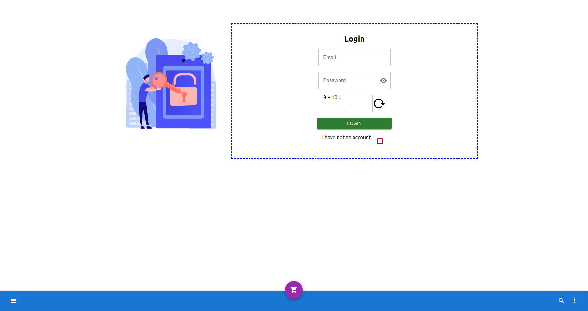
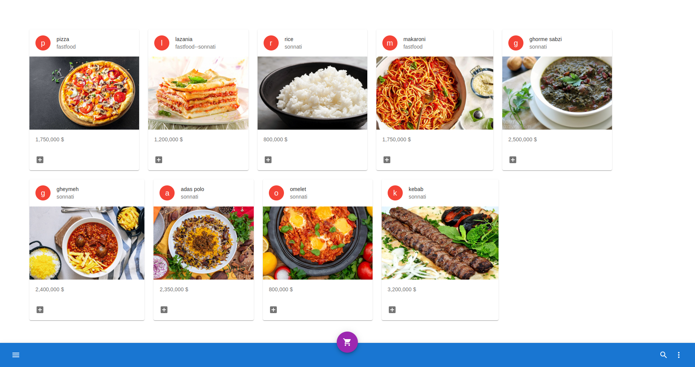
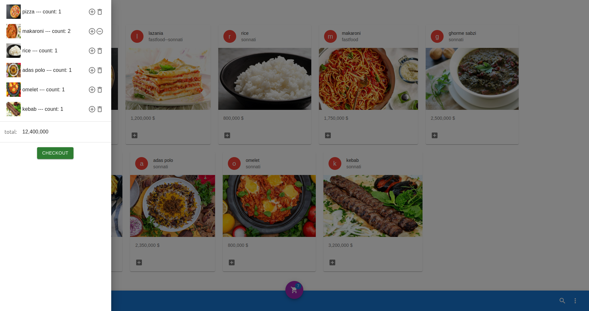
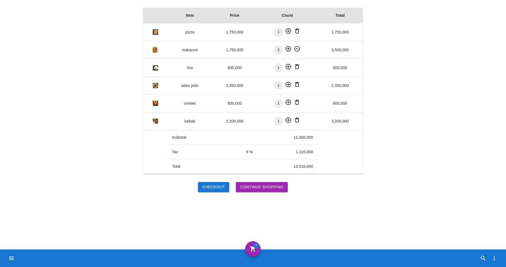
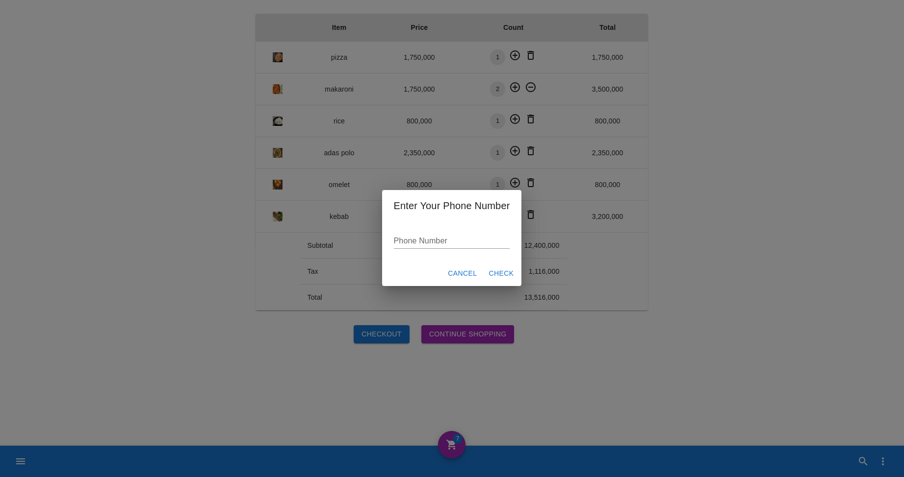
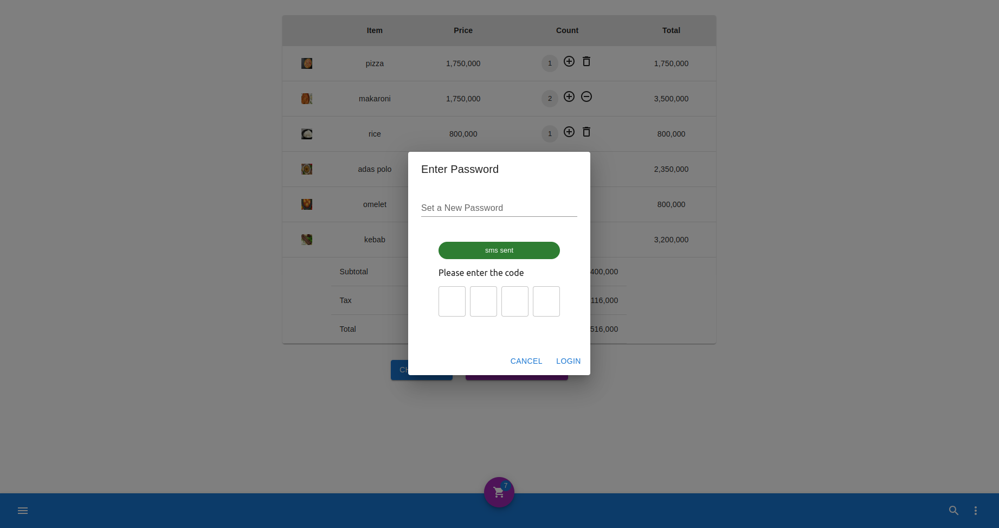
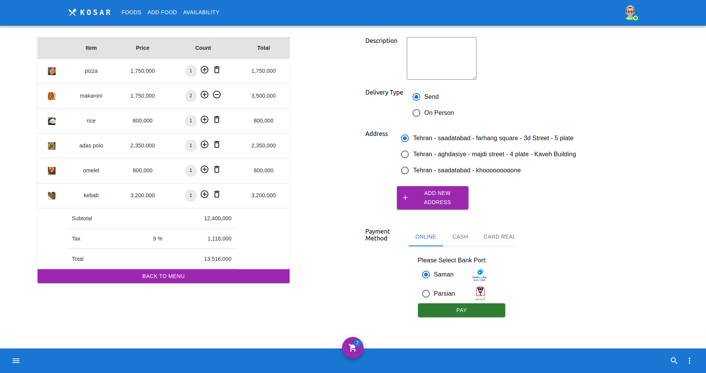
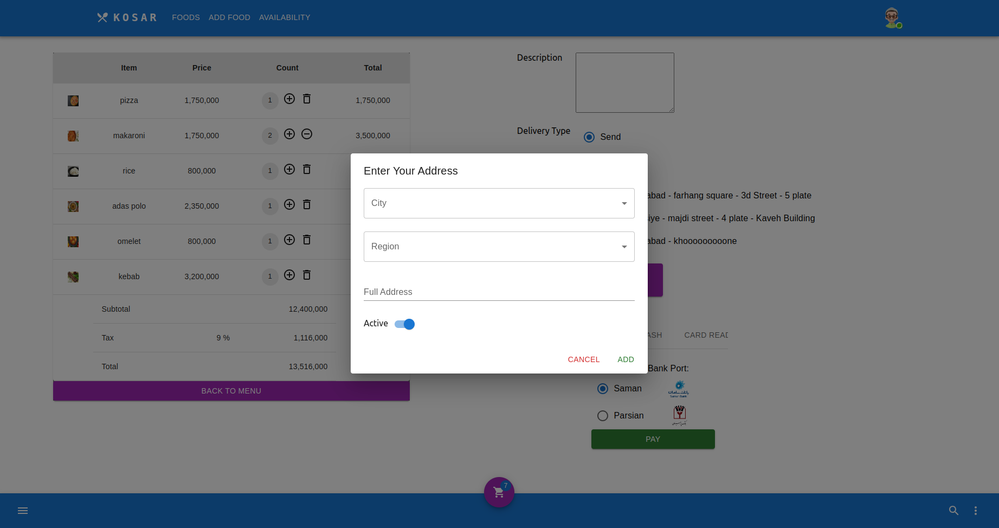

# Restaurant Django web Application

## Features

This website contains:

* login / logout for admins
* admins can add new food
* admins can edit existing foods
* signup as customer
* signin as customer
* any user can see and add food to cart
* just login users can checkout
* each user can have multiple addresses but one active address
* there are two type of users:
    * admin
    * personnel
    * customer

* admin:
    * can create food
    * can update food

* customer can:
    * login/ register/
    * add to cart
    * delete from cart
    * add discount code
    * define/ delete/ active address
    * select pay method

## Technologies
* React
* JavaScript
* Material UI
* HTML
* CSS
* Bootstrap

### Here are some pages of This Project

